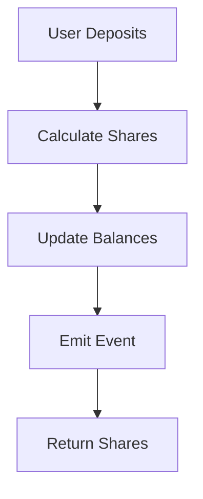

# Project Enhancement Suggestions

> **Comprehensive roadmap for improving the Solidity 50-Project Mastery Curriculum**

This document outlines actionable enhancements to improve the overall project quality, developer experience, and learning outcomes.

---

## 📊 Current State Analysis

### Strengths ✅
- Comprehensive 50-project curriculum
- Well-documented root guides (LEARNING_GUIDE.md, DEFI_REFERENCE.md)
- Good test coverage in many projects
- Gas benchmarks in some projects
- Varied documentation quality (some projects excellent, others minimal)

### Areas for Improvement 🔧
- Inconsistent project structure
- Varying documentation quality
- Missing standardized tooling
- No progress tracking system
- Limited visual aids
- No automated quality checks

---

## 🎯 Enhancement Categories

### 1. Standardization & Consistency

#### A. Project Structure Template
**Priority: High**

Create a standardized project structure that all projects should follow:

```
XX-project-name/
├── README.md                    # Main documentation (required)
├── QUICKSTART.md                # Quick setup guide (optional but recommended)
├── PROJECT_OVERVIEW.md         # Detailed overview (for complex projects)
├── foundry.toml                 # Foundry configuration
├── .gitignore                  # Git ignore rules
├── remappings.txt              # Import path mappings (if needed)
│
├── src/
│   ├── [ProjectName].sol       # Skeleton contract with TODOs
│   └── solution/
│       └── [ProjectName]Solution.sol  # Complete solution
│
├── test/
│   └── [ProjectName].t.sol     # Test suite
│
└── script/
    └── Deploy[ProjectName].s.sol  # Deployment script
```

**Action Items:**
- [ ] Create `PROJECT_TEMPLATE/` directory with standard structure
- [ ] Document structure requirements in `CONTRIBUTING.md`
- [ ] Create script to validate project structure
- [ ] Update existing projects to match template (gradually)

#### B. README Template
**Priority: High**

Standardize README.md structure across all projects:

```markdown
# Project XX: [Project Name]

> **Brief one-line description**

## Learning Objectives
- Objective 1
- Objective 2

## Prerequisites
- Project XX: [Name]
- Concept: [Concept]

## Difficulty
⭐ Beginner | ⭐⭐ Intermediate | ⭐⭐⭐ Advanced | ⭐⭐⭐⭐ Expert

## Estimated Time
2-3 hours

## Key Concepts
- Concept 1
- Concept 2

## Implementation Checklist
- [ ] Task 1
- [ ] Task 2

## Testing
```bash
forge test
forge test --gas-report
```

## Related Projects
- Project XX: [Related project]

## Additional Resources
- [Link to relevant EIP]
- [Link to documentation]
```

**Action Items:**
- [ ] Create `docs/TEMPLATE_README.md`
- [ ] Add difficulty ratings to all projects
- [ ] Add prerequisites to all projects
- [ ] Standardize "Related Projects" sections

#### C. Naming Conventions
**Priority: Medium**

Standardize file naming across all projects:
- Contract files: `PascalCase.sol`
- Test files: `PascalCase.t.sol`
- Script files: `DeployPascalCase.s.sol`
- Solution files: `PascalCaseSolution.sol`

**Action Items:**
- [ ] Document naming conventions
- [ ] Create script to check naming consistency
- [ ] Gradually rename non-conforming files

---

### 2. Developer Experience

#### A. Root-Level Tooling Scripts
**Priority: High**

Create helpful scripts at repository root:

**`scripts/setup.sh`**
```bash
#!/bin/bash
# Install Foundry if not present
# Install OpenZeppelin contracts
# Verify installation
# Run initial tests
```

**`scripts/test-all.sh`**
```bash
#!/bin/bash
# Run tests for all projects
# Generate combined test report
# Check for failures
```

**`scripts/validate-structure.sh`**
```bash
#!/bin/bash
# Validate all projects match template structure
# Check for required files
# Report inconsistencies
```

**`scripts/gas-benchmark.sh`**
```bash
#!/bin/bash
# Run gas reports for all projects
# Generate comparison table
# Track gas improvements over time
```

**Action Items:**
- [ ] Create `scripts/` directory
- [ ] Implement setup script
- [ ] Implement test runner script
- [ ] Implement structure validator
- [ ] Implement gas benchmark aggregator

#### B. Progress Tracking System
**Priority: Medium**

Create a progress tracking system:

**`PROGRESS.md`** (user-specific, gitignored)
```markdown
# My Learning Progress

## Completed Projects
- [x] Project 01: Datatypes & Storage (2024-01-15)
- [x] Project 02: Functions & Payable (2024-01-16)
- [ ] Project 03: Events & Logging

## Current Project
Project 03: Events & Logging

## Notes
- Struggled with indexed parameters
- Need to review bloom filters

## Time Tracking
- Project 01: 2.5 hours
- Project 02: 3 hours
- Total: 5.5 hours
```

**`scripts/generate-progress.sh`**
```bash
#!/bin/bash
# Generate progress template
# Track completion based on test results
# Generate statistics
```

**Action Items:**
- [ ] Create progress template
- [ ] Create progress generator script
- [ ] Add progress tracking to README
- [ ] Create visual progress dashboard (optional)

#### C. Makefile at Root
**Priority: Medium**

Create root-level Makefile for common tasks:

```makefile
.PHONY: setup test test-all gas-report validate install-deps

setup:
	@./scripts/setup.sh

test:
	@forge test

test-all:
	@./scripts/test-all.sh

gas-report:
	@forge test --gas-report

validate:
	@./scripts/validate-structure.sh

install-deps:
	@forge install openzeppelin/openzeppelin-contracts --no-commit

format:
	@forge fmt

lint:
	@forge fmt --check

coverage:
	@forge coverage
```

**Action Items:**
- [ ] Create root `Makefile`
- [ ] Document Makefile targets
- [ ] Add to README quick start

---

### 3. Learning Experience Enhancements

#### A. Difficulty Ratings
**Priority: High**

Add consistent difficulty ratings to all projects:

- ⭐ **Beginner**: No prerequisites, basic concepts
- ⭐⭐ **Intermediate**: Requires foundations, some complexity
- ⭐⭐⭐ **Advanced**: Complex patterns, multiple concepts
- ⭐⭐⭐⭐ **Expert**: Production-grade, advanced DeFi

**Action Items:**
- [ ] Rate all 50 projects
- [ ] Add difficulty badges to README tables
- [ ] Filter projects by difficulty
- [ ] Add difficulty to PROJECT_MANAGEMENT.md

#### B. Visual Learning Aids
**Priority: Medium**

Add visual diagrams and flowcharts:

**Storage Layout Diagrams**
- Visual representation of storage slots
- Show packing optimization
- Compare before/after optimization

**Attack Flow Diagrams**
- Visualize reentrancy attacks
- Show MEV sandwich attacks
- Illustrate oracle manipulation

**Architecture Diagrams**
- ERC-4626 vault flow
- Multi-sig wallet flow
- Proxy upgrade flow

**Action Items:**
- [ ] Create `docs/diagrams/` directory
- [ ] Use Mermaid diagrams in markdown
- [ ] Add diagrams to relevant projects
- [ ] Create diagram generation script

**Example Mermaid Diagram:**


#### C. Common Mistakes Sections
**Priority: Medium**

Add "Common Mistakes" sections to project READMEs:

```markdown
## ⚠️ Common Mistakes

### Mistake 1: [Description]
**Wrong:**
```solidity
// Bad code
```

**Right:**
```solidity
// Good code
```

**Why:** Explanation
```

**Action Items:**
- [ ] Add common mistakes to Project 01-10
- [ ] Collect mistakes from solution reviews
- [ ] Create common mistakes database
- [ ] Link to relevant projects

#### D. Interactive Challenges
**Priority: Low**

Add optional advanced challenges:

```markdown
## 🎯 Advanced Challenges

### Challenge 1: [Name]
**Difficulty:** ⭐⭐⭐
**Time:** 1-2 hours
**Description:** [What to build]
**Hints:** [Optional hints]
**Solution:** [Link to solution]
```

**Action Items:**
- [ ] Add challenges to 5-10 key projects
- [ ] Create challenge solutions
- [ ] Track challenge completion

---

### 4. Quality Assurance

#### A. Test Coverage Requirements
**Priority: High**

Define minimum test coverage requirements:

- **Beginner Projects**: 80% coverage
- **Intermediate Projects**: 85% coverage
- **Advanced Projects**: 90% coverage
- **Expert Projects**: 95% coverage

**Test Categories Required:**
- ✅ Happy path tests
- ✅ Edge case tests
- ✅ Revert tests
- ✅ Event emission tests
- ✅ Gas benchmark tests (for critical functions)
- ✅ Fuzz tests (where applicable)
- ✅ Invariant tests (for complex projects)

**Action Items:**
- [ ] Document coverage requirements
- [ ] Create coverage checker script
- [ ] Add coverage badges to READMEs
- [ ] Generate coverage reports

#### B. Gas Benchmark Standards
**Priority: Medium**

Standardize gas benchmarking:

**Required Benchmarks:**
- Deployment gas
- Critical function gas (deposit, withdraw, transfer, etc.)
- Comparison with alternatives (if applicable)

**Format:**
```markdown
## ⛽ Gas Benchmarks

| Operation | Gas Cost | Notes |
|-----------|----------|-------|
| deploy() | 1,234,567 | Initial deployment |
| deposit(1000) | 45,678 | Single deposit |
| withdraw(1000) | 52,345 | Single withdrawal |
```

**Action Items:**
- [ ] Add gas benchmarks to all projects
- [ ] Create gas benchmark template
- [ ] Generate gas comparison tables
- [ ] Track gas improvements over time

#### C. Security Checklist
**Priority: High**

Add security checklist to each project:

```markdown
## 🔒 Security Checklist

- [ ] Reentrancy protection implemented
- [ ] Access control verified
- [ ] Integer overflow/underflow handled
- [ ] Input validation present
- [ ] Events emitted for state changes
- [ ] Error messages are informative
- [ ] Gas optimization considered
- [ ] Test coverage adequate
```

**Action Items:**
- [ ] Create security checklist template
- [ ] Add checklists to all projects
- [ ] Create security audit script
- [ ] Link to DEFI_REFERENCE.md for attack vectors

---

### 5. Documentation Enhancements

#### A. Glossary
**Priority: Medium**

Create comprehensive glossary:

**`docs/GLOSSARY.md`**
```markdown
# Solidity & DeFi Glossary

## A
**ABI (Application Binary Interface)**
Standard way to encode and decode data for Ethereum smart contracts.

**Access Control**
Mechanism to restrict function execution to authorized addresses.

## B
**Block**
Collection of transactions validated and added to the blockchain.

[Alphabetical list continues...]
```

**Action Items:**
- [ ] Create glossary with 100+ terms
- [ ] Link glossary from README
- [ ] Add glossary links in project READMEs
- [ ] Keep glossary updated

#### B. Cheat Sheets
**Priority: Medium**

Create quick reference cheat sheets:

**`docs/CHEAT_SHEETS/`**
- `solidity-syntax.md` - Quick syntax reference
- `foundry-commands.md` - Foundry command reference
- `gas-costs.md` - Common gas costs
- `security-patterns.md` - Security best practices
- `erc-standards.md` - ERC standard quick reference

**Action Items:**
- [ ] Create cheat sheet directory
- [ ] Generate cheat sheets
- [ ] Link from LEARNING_GUIDE.md
- [ ] Create printable PDF versions (optional)

#### C. Video Tutorials (Future)
**Priority: Low**

Consider adding video tutorials:
- Project walkthroughs
- Concept explanations
- Common mistakes demonstrations
- Attack vector visualizations

**Action Items:**
- [ ] Evaluate video hosting platform
- [ ] Create video script templates
- [ ] Record 5-10 key project tutorials
- [ ] Embed videos in READMEs

---

### 6. Automation & CI/CD

#### A. GitHub Actions
**Priority: High**

Create GitHub Actions workflows:

**.github/workflows/test.yml**
```yaml
name: Test All Projects

on: [push, pull_request]

jobs:
  test:
    runs-on: ubuntu-latest
    steps:
      - uses: actions/checkout@v3
      - uses: foundry-actions/foundry-toolchain@v1
      - run: forge test
      - run: forge coverage
```

**.github/workflows/validate.yml**
```yaml
name: Validate Structure

on: [push, pull_request]

jobs:
  validate:
    runs-on: ubuntu-latest
    steps:
      - uses: actions/checkout@v3
      - run: ./scripts/validate-structure.sh
      - run: forge fmt --check
```

**Action Items:**
- [ ] Create `.github/workflows/` directory
- [ ] Implement test workflow
- [ ] Implement validation workflow
- [ ] Add gas benchmark workflow
- [ ] Add coverage reporting

#### B. Pre-commit Hooks
**Priority: Medium**

Create pre-commit hooks:

**.git/hooks/pre-commit**
```bash
#!/bin/bash
# Format code
forge fmt

# Run tests for changed projects
# Check structure
# Validate naming
```

**Action Items:**
- [ ] Create pre-commit hook template
- [ ] Document hook setup
- [ ] Add to CONTRIBUTING.md

---

### 7. Community Features

#### A. Discussion Templates
**Priority: Low**

Create GitHub discussion templates:

**`.github/DISCUSSION_TEMPLATE/question.md`**
```markdown
## Project Number
[Which project are you working on?]

## Question
[Your question]

## What I've Tried
[What have you attempted?]

## Code Snippet
[Relevant code]
```

**Action Items:**
- [ ] Create discussion templates
- [ ] Enable GitHub Discussions
- [ ] Moderate discussions

#### B. Solution Sharing Guidelines
**Priority: Low**

Create guidelines for sharing solutions:

```markdown
## Sharing Your Solution

1. **Don't share complete solutions publicly**
2. **Do share:**
   - Your approach and thought process
   - Specific challenges you faced
   - Alternative implementations
   - Gas optimizations you discovered
3. **Use spoiler tags** for code snippets
```

**Action Items:**
- [ ] Create solution sharing guidelines
- [ ] Add to CONTRIBUTING.md
- [ ] Create solution review process

---

### 8. Additional Resources

#### A. Project Templates
**Priority: Medium**

Create starter templates:

**`templates/`**
- `basic-contract/` - Basic contract template
- `erc20-template/` - ERC-20 token template
- `erc721-template/` - ERC-721 NFT template
- `vault-template/` - ERC-4626 vault template

**Action Items:**
- [ ] Create template directory
- [ ] Generate templates
- [ ] Document template usage
- [ ] Add template generator script

#### B. External Resources Index
**Priority: Low**

Create curated list of external resources:

**`docs/EXTERNAL_RESOURCES.md`**
```markdown
# External Learning Resources

## Official Documentation
- [Solidity Docs](https://docs.soliditylang.org/)
- [Foundry Book](https://book.getfoundry.sh/)
- [OpenZeppelin Docs](https://docs.openzeppelin.com/)

## Security
- [Consensys Best Practices](https://consensys.github.io/smart-contract-best-practices/)
- [SWC Registry](https://swcregistry.io/)

## DeFi
- [DeFi Pulse](https://defipulse.com/)
- [DeFi Llama](https://defillama.com/)

[Organized by category...]
```

**Action Items:**
- [ ] Create external resources file
- [ ] Curate high-quality resources
- [ ] Link from README
- [ ] Keep updated

---

## 📋 Implementation Priority

### Phase 1: Foundation (Weeks 1-2)
1. ✅ Standardize project structure template
2. ✅ Create README template
3. ✅ Add difficulty ratings to all projects
4. ✅ Create root-level scripts (setup, test-all, validate)
5. ✅ Create root Makefile

### Phase 2: Quality (Weeks 3-4)
6. ✅ Define test coverage requirements
7. ✅ Add gas benchmarks to all projects
8. ✅ Create security checklist template
9. ✅ Set up GitHub Actions
10. ✅ Add common mistakes sections

### Phase 3: Enhancement (Weeks 5-6)
11. ✅ Create glossary
12. ✅ Create cheat sheets
13. ✅ Add visual diagrams (Mermaid)
14. ✅ Create progress tracking system
15. ✅ Add project templates

### Phase 4: Polish (Weeks 7-8)
16. ✅ Create external resources index
17. ✅ Add advanced challenges
18. ✅ Set up pre-commit hooks
19. ✅ Create discussion templates
20. ✅ Final documentation review

---

## 🎯 Success Metrics

### Quantitative
- **Test Coverage**: Average 85%+ across all projects
- **Documentation**: 100% of projects have standardized README
- **Gas Benchmarks**: 100% of projects include benchmarks
- **Structure Compliance**: 100% of projects match template

### Qualitative
- **User Feedback**: Positive feedback on structure and clarity
- **Completion Rate**: Higher project completion rates
- **Learning Outcomes**: Better understanding demonstrated in tests
- **Community Engagement**: Active discussions and contributions

---

## 📝 Notes

- **Gradual Implementation**: Don't try to implement everything at once
- **Backward Compatibility**: Ensure changes don't break existing workflows
- **Community Input**: Gather feedback before major changes
- **Documentation First**: Document before implementing
- **Test Everything**: Test all scripts and automation

---

## 🤝 Contributing

Want to help implement these enhancements?

1. **Pick a task** from the priority list
2. **Create an issue** describing your plan
3. **Submit a PR** with your implementation
4. **Update this document** when complete

---

**Last Updated:** 2024-01-XX
**Status:** Planning Phase
**Next Review:** [Date]
